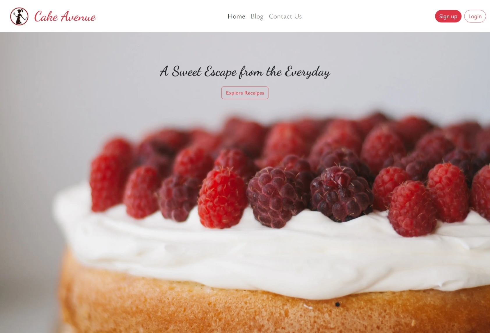

# Cake Avenue
Cake Avenue is a blogging website that is focused on providing baking enthusiasts with a platform to share their passion for baking, connect with other bakers, and learn new techniques and recipes.

## Getting Started

To get started with Cake Avenue, follow these steps:

1- Clone the repository to your local machine:
```bash
git clone https://github.com/<your-username>/cake-avenue.git
```

2- Install the dependencies:
```bash
cd cake-avenue
npm install
```
3- Configure the environment variables:
```bash
NEXT_PUBLIC_STRIPE_PUBLISHABLE_KEY=<your-stripe-publishable-key>
STRIPE_SECRET_KEY=<your-stripe-secret-key>
NEXTAUTH_URL=<your-nextauth-url>
GITHUB_ID=<your-github-app-id>
GITHUB_SECRET=<your-github-app-secret>

```

4- Start the development server:
```bash
npm run dev
```

5- Open the project in your browser:
```bash
http://localhost:3000
```
## Features

Cake Avenue has the following features:

- User authentication and authorization using GitHub, Facebook OAuth
- Ability to browse various types of recipes
- Ability to create, edit, and delete recipes

## Screenshots




## Technologies

Cake Avenue is built using the following technologies:

- [Next.js](https://nextjs.org/)
- [React](https://reactjs.org/)
- [Bootstrap](https://getbootstrap.com/)

## Contributing

To contribute to Cake Avenue, follow these steps:

1- Fork this repository.

2- Create a branch: `git checkout -b <branch_name>`.

3- Make your changes and commit them: `git commit -m '<commit_message>'`

4- Push to the original branch: `git push origin <project_name>/<location>`

5- Create the pull request.

6- Wait for the pull request to be reviewed and merged.

## License
Cake Avenue is licensed under the MIT License. See LICENSE for more information.


